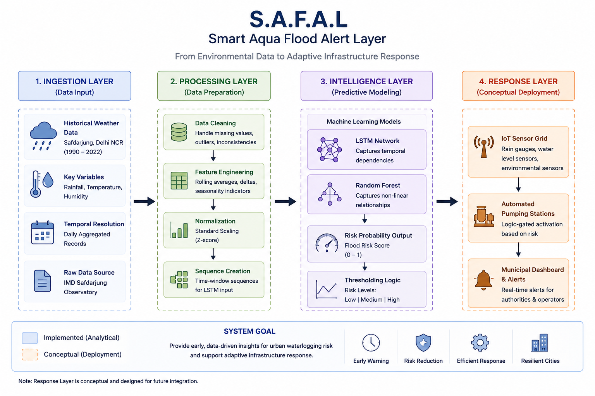
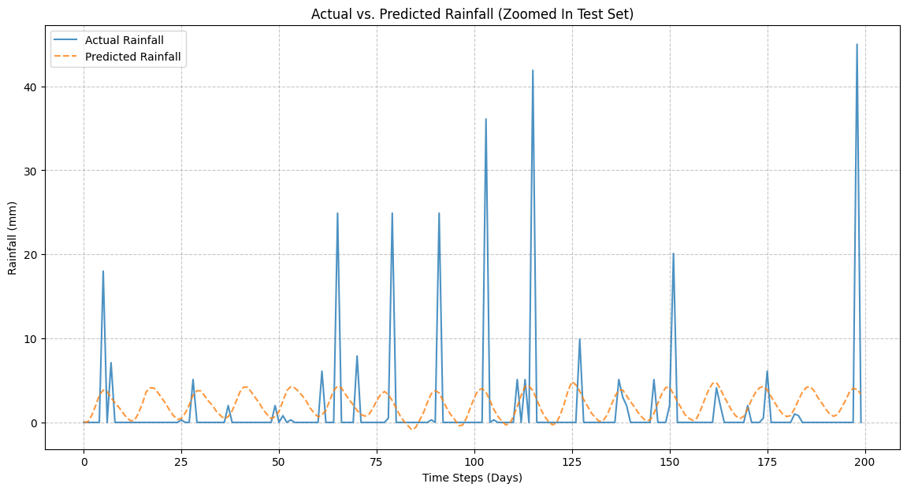
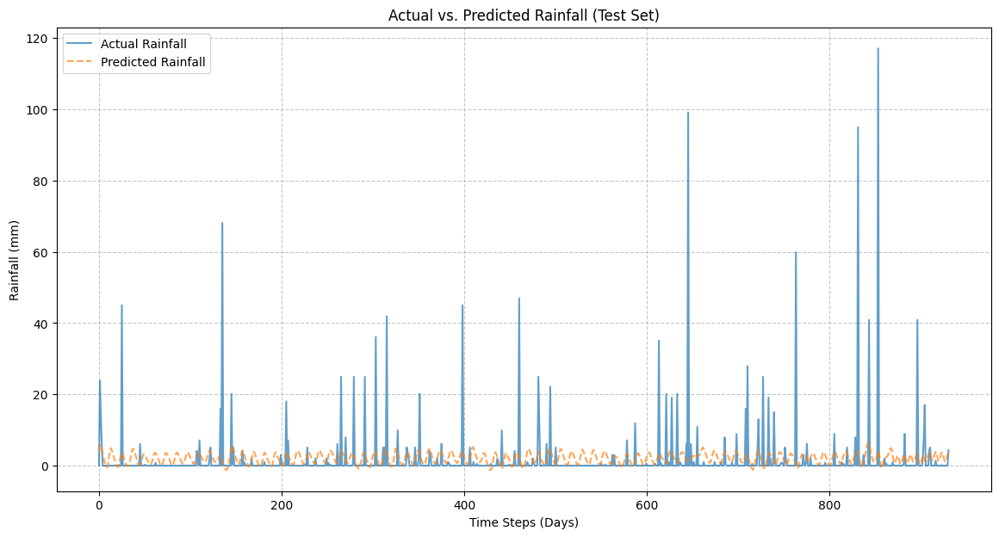
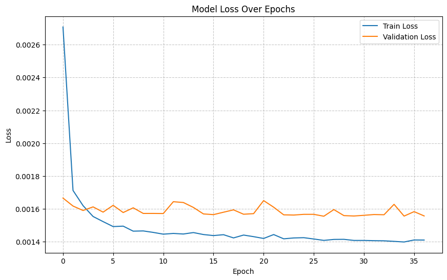

<!DOCTYPE html>
<html lang="en">
<head>
    <meta charset="UTF-8">
    <meta name="viewport" content="width=device-width, initial-scale=1.0">
    <title>S.A.F.A.L. Predictive Systems Dashboard</title>
    
    
</head>
<body class="bg-gray-50 text-slate-900 font-sans">

    <!-- Navigation Header -->
    <nav class="gradient-bg text-white p-4 shadow-lg">
        

            

                

                    <svg xmlns="http://www.w3.org/2000/svg" class="h-6 w-6" fill="none" viewBox="0 0 24 24" stroke="currentColor">
                        <path stroke-linecap="round" stroke-linejoin="round" stroke-width="2" d="M19.428 15.428a2 2 0 00-1.022-.547l-2.387-.477a6 6 0 00-3.86.517l-.318.158a6 6 0 01-3.86.517L6.05 15.21a2 2 0 00-1.806.547M8 4h8l-1 1v5.172a2 2 0 00.586 1.414l5 5c1.26 1.26.367 3.414-1.415 3.414H4.828c-1.782 0-2.674-2.154-1.414-3.414l5-5A2 2 0 009 10.172V5L8 4z" />
                    </svg>
                

                <h1 class="text-xl font-bold tracking-tight">S.A.F.A.L. Command Center</h1>
            

            

                 Research Simulation
                Region: Safdarjung, Delhi
            

        

    </nav>

    <main class="max-w-7xl mx-auto p-6 grid grid-cols-1 lg:grid-cols-3 gap-6">
        
        <!-- Left Column: Metrics & Analysis -->
        

            <!-- Risk Level Card -->
            

                <h2 class="text-gray-500 text-xs font-bold uppercase tracking-widest mb-4">Current Prediction Risk</h2>
                

                    

                        
MODERATE

                        
Based on 7-day soil saturation proxy

                    

                    

                        
0.64

                        
Risk Score

                    

                

                

                    

                

            

            <!-- Architecture Snapshot -->
            

                <h2 class="text-gray-500 text-xs font-bold uppercase tracking-widest mb-3">Pipeline Architecture</h2>
                

                    
                

                
Sequential data flow: IMD Ingestion to Model Logic.

            

            <!-- Engineering Takeaway -->
            

                <h3 class="text-blue-800 font-bold text-sm mb-2">Systems Insight</h3>
                

                    The "Saturation Tipping Point" in Delhi was observed at ~150mm/week. Beyond this, response logic shifts from drainage management to automated pumping activation (Conceptual).
                

            

        

        <!-- Center/Right: Data Visualizations -->
        

            <!-- Main Graph Area: Prediction vs Actual -->
            

                

                    <h2 class="font-bold text-lg text-slate-800">Model Verification: Sequential vs. Actual</h2>
                    

                        Validation Set
                    

                

                
                

                    
                

                
Observing the model's tracking accuracy during hydrological outliers in the test window.

            

            <!-- Bottom Grid: Historical Trend and Loss Curve -->
            

                <!-- Rainfall Trend Analysis -->
                

                    <h3 class="text-xs font-bold text-gray-400 uppercase mb-3">Historical Trend (Safdarjung)</h3>
                    

                        
                    

                    
32-year precipitation longitudinal study identifying monsoon variability.

                

                
                <!-- Training Loss Curve -->
                

                    <h3 class="text-xs font-bold text-gray-400 uppercase mb-3">Model Convergence (Loss)</h3>
                    

                        
                    

                    
Weighted loss optimization indicating model stability across 50 epochs.

                

            

        

    </main>

    <footer class="max-w-7xl mx-auto p-6 text-center text-gray-400 text-xs border-t border-gray-100 mt-6">
        
S.A.F.A.L | Exploratory Engineering Portfolio Project | Safdarjung Meteorological Dataset (1990–2022)

    </footer>

</body>
</html>
